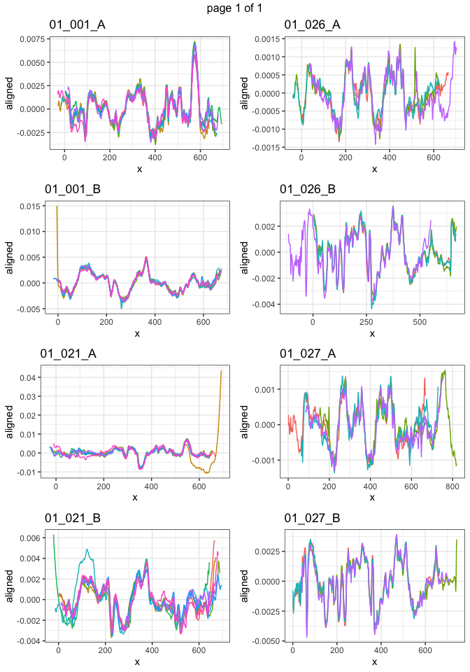

<!-- README.md is generated from README.Rmd. Please edit that file -->

# markers

<!-- badges: start -->

[](https://github.com/heike/markers/actions/workflows/R-CMD-check.yaml)
<!-- badges: end -->

The goal of markers is to …

## Installation

You can install the development version of markers like so:

``` r
# FILL THIS IN! HOW CAN PEOPLE INSTALL YOUR DEV PACKAGE?
```

## Example

This is a basic example which shows you how to solve a common problem:

``` r
library(markers)
## basic example code
```

1.  Load toolmarks

``` r
load("data/toolmarks.RData")
```

2.  Align by set

``` r
library(tidyverse)
#> ── Attaching packages ─────────────────────────────────────── tidyverse 1.3.1 ──
#> ✔ ggplot2 3.3.6     ✔ purrr   0.3.4
#> ✔ tibble  3.1.7     ✔ dplyr   1.0.9
#> ✔ tidyr   1.2.0     ✔ stringr 1.4.0
#> ✔ readr   2.1.2     ✔ forcats 0.5.1
#> ── Conflicts ────────────────────────────────────────── tidyverse_conflicts() ──
#> ✖ dplyr::filter() masks stats::filter()
#> ✖ dplyr::lag()    masks stats::lag()
reps <- toolmarks %>% group_by(tool, plate, side, angle, direction, size) %>%
  tidyr::nest()
reps <- reps %>% mutate(
  aligned_set = data %>% purrr::map(sig_align_set, value=signature, group = mark)
)
```

3.  Visualize

``` r
reps <- reps %>% 
  unite("id", tool, plate, side, remove = FALSE) %>%
  mutate(
  plot = purrr::map2(aligned_set, id, .f = function(d, id) {
    gg <- d %>% ggplot(aes(x =x, y = aligned, colour = factor(mark))) + geom_line() +
      theme_bw() + 
      ggtitle(id[1]) +
      theme(legend.position="none")
    gg
  })
)

library(gridExtra)
#> 
#> Attaching package: 'gridExtra'
#> The following object is masked from 'package:dplyr':
#> 
#>     combine
do.call(marrangeGrob, list(reps$plot[1:8], nrow=4, ncol=2))
```



``` r

ml = do.call(marrangeGrob, list(reps$plot, nrow=4, ncol=2))
ggsave("multipage.pdf", ml)       
#> Saving 7 x 10 in image
```

Download [pdf](multipage.pdf) with multiple pages of figures.
