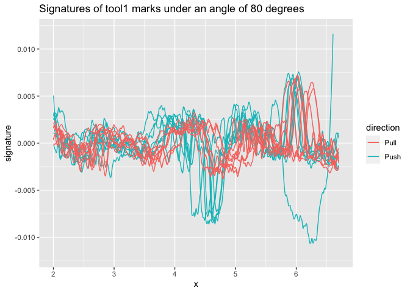

<!-- README.md is generated from README.Rmd. Please edit that file -->

# tmaRks

<!-- badges: start -->

[](https://github.com/heike/tmaRks/actions/workflows/R-CMD-check.yaml)
<!-- badges: end -->

The goal of tmaRks is to extract and compare signatures from three
dimensional topographic scans of screwdriver marks.

## Installation

You can install the development version of `tmaRks` from Github:

``` r
remotes::install_github("heike/tmaRks")
```

## Example

``` r
library(tmaRks)
library(tidyverse, quietly = TRUE)
## basic example code
```

We have provided a sample data set of tool marks created by a total of
23 different screw drivers. This data is available as object
`toolmarks`.

``` r
data(toolmarks)
head(toolmarks)
#> # A tibble: 6 × 11
#>    tool size  side  direction angle  mark TID            x     y   value signa…¹
#>   <int> <chr> <chr> <chr>     <int> <int> <chr>      <dbl> <dbl>   <dbl>   <dbl>
#> 1     1 S     A     F            80     1 T01SA-F80…  2.00  3.62 -0.0816 0.00195
#> 2     1 S     A     F            80     1 T01SA-F80…  2.01  3.62 -0.0816 0.00193
#> 3     1 S     A     F            80     1 T01SA-F80…  2.02  3.62 -0.0816 0.00184
#> 4     1 S     A     F            80     1 T01SA-F80…  2.02  3.62 -0.0817 0.00173
#> 5     1 S     A     F            80     1 T01SA-F80…  2.03  3.62 -0.0817 0.00166
#> 6     1 S     A     F            80     1 T01SA-F80…  2.04  3.62 -0.0817 0.00157
#> # … with abbreviated variable name ¹​signature
```

Marks are distinguished by their Tool ID (TID), which has the general
form of Tool number (1-20), size (S, M, L), side (A,B), followed by
direction (F,B) and angle, and finally the replicate (1-8):

``` r
sample(unique(toolmarks$TID), size=5)
#> [1] "T09LA-F80-01" "T01SB-B80-05" "T19SB-F80-05" "T16SB-F80-02" "T03LB-F80-01"
```

For side A of the first small screw driver, we have a total of 8 marks
made under an angle of 80 degrees in forward direction. Each mark
consists of a signature of length 667:

``` r
toolmarks %>% slice(grep("^T01SA-F80",TID)) %>% count(TID)
#> # A tibble: 8 × 2
#>   TID              n
#>   <chr>        <int>
#> 1 T01SA-F80-01   667
#> 2 T01SA-F80-02   667
#> 3 T01SA-F80-03   667
#> 4 T01SA-F80-04   667
#> 5 T01SA-F80-05   667
#> 6 T01SA-F80-06   667
#> 7 T01SA-F80-07   667
#> 8 T01SA-F80-08   667
```

Each of the marks is represented by a profile (`value`) - derived from a
suitable crosscut across the striations visible in a scan.

``` r
t1sa <- toolmarks %>% slice(grep("^T01SA",TID))
t1sa %>% 
  ggplot(aes(x = x, y = value)) + geom_line(aes(group = TID, colour = direction)) +
  ggtitle("Profiles of tool1 marks under an angle of 80 degrees")
```


While we can see some similarities between the profiles,  
the dominant structures in them are associated with the procedures of
getting the marks (both in creating the marks: adjustment of the screw
driver in the rig; and in retrieving the marks with a hand-held scanner:
slightly uneven pressure in the surface capture).

``` r
t1sa %>% 
  ggplot(aes(x = x, y = signature)) + geom_line(aes(group = TID, colour = direction)) +
  ggtitle("Signatures of tool1 marks under an angle of 80 degrees") +
  ylim(c(-0.012, 0.012))
#> Warning: Removed 13 rows containing missing values (`geom_line()`).
```



The procedure for extracting signatures from profiles is susceptible to
edge effects:

``` r
t1sab80_2 <- t1sa %>% 
  filter(TID == "T01SA-B80-02")

t1sab80_2_sub <- t1sa %>% 
  filter(TID == "T01SA-B80-02", x < 6.3)
res <- tmaRks::cc_get_signature(t1sab80_2) # trimmed again, not even using the reduced profile

t1sab80_2 %>%
  ggplot(aes(x = x, y = value)) + 
  geom_line(aes(group = TID, colour = "profile")) +
  ggtitle("T01SA-B80-02 - profile and signatures") +
  geom_line(aes(y = signature, group = TID, colour = "signature-full")) +
  geom_line(aes(y = sig, colour = "signature-reduced"), data = res) 
#> Warning: Removed 129 rows containing missing values (`geom_line()`).
```


The similarities between marks are stronger for the signatures than the
profiles, but the signatures are not aligned well laterally (because of
the scanning procedure).

For aligning signatures, we single out one signature, then align with
respect to that signature using the maximized cross-correlation:

Aligning the marks separately by direction:

``` r
t1saf <- t1sa %>% filter(direction == "F") %>%
  sig_align_set(signature, group=mark, min.overlap = 400)

t1sab <- t1sa %>% filter(direction == "B") %>%
  sig_align_set(signature, group=mark, min.overlap = 400)
```

``` r
t1saf %>% 
  ggplot(aes(x = aligned_x, y = signature, group = TID)) +
  geom_line() +
  ggtitle("Forward direction")
```


``` r
t1sab %>% 
  ggplot(aes(x = aligned_x, y = signature, group = TID)) +
  geom_line() +
  ggtitle("Backward direction") + 
  ylim(c(-0.012, 0.012))
#> Warning: Removed 13 rows containing missing values (`geom_line()`).
```


Aligning the marks together:

``` r
t1sa <- t1sa %>% 
  sig_align_set(signature, group=interaction(mark, direction), min.overlap = 400)

t1sa %>% 
  ggplot(aes(x = aligned_x, y = signature, group = TID)) +
  geom_line(aes(colour = direction)) +
  ggtitle("Both directions together") + 
  ylim(c(-0.012, 0.012))
#> Warning: Removed 13 rows containing missing values (`geom_line()`).
```


While there are strong similarities between signatures made by using the
same side of a tool in different directions, there are also pronounced
differences visible between the two sets of signatures.

2.  Align by set

``` r


reps <- toolmarks %>% filter(tool <= 3, size == "L") %>% group_by(tool, side, size) %>%
  tidyr::nest()
reps <- reps %>% mutate(
  data = data %>% purrr::map(sig_align_set, value=signature, group = mark, min.overlap = 500)
) %>% tidyr::unnest(cols=data)
```

3.  Visualize

``` r
reps <- reps %>% 
  unite("id", tool, side, size, remove = FALSE) %>%
  mutate(
  plot = purrr::map2(aligned_set, id, .f = function(d, id) {
    gg <- d %>% ggplot(aes(x = aligned_x, y = signature, colour = factor(mark))) + geom_line() +
      theme_bw() + 
      ggtitle(id[1]) +
      theme(legend.position="none")
    gg
  })
)

marks_01_A_S <- reps %>% filter(tool==01, side=="A", size=="S")

length(reps$data)

dim(reps$data[[1]])

table(reps$data[[1]]$direction)
table(reps$data[[2]]$direction)


table(reps$data[[3]]$angle)


reps$data[[3]]$angle


dim(marks_01_A_S$data[1])


str(reps)
names(reps)


table(reps$tool)
table(reps$side)
table(reps$size)

reps$data[[1]]$y

reps$


#reps$aligned_set[[3]] %>% summary()
#reps$aligned_set[[3]] %>% names()
#reps[3,]

library(readr)
saveRDS(reps, "data/reps.rds")

reps <- readRDS("data/reps.rds")


library(gridExtra)
do.call(marrangeGrob, list(reps$plot[1:8], nrow=4, ncol=2))


ml = do.call(marrangeGrob, list(reps$plot, nrow=4, ncol=2))
ggsave(plot=ml, filename="figures/multipage.pdf")       
```

Download [pdf](multipage.pdf) with multiple pages of figures.

The steps so far are:

1.  Convert stl files to x3p files and save in an appropriate folder

``` r
stls <- dir(pattern="stl", path="data/stl_files", full.names = TRUE)


for (file in stls) {
  stl_tool <- rgl::readSTL(file, plot=FALSE)
  x3p <- stl_to_x3p(stl_tool)
  x3p %>% x3p_write(file = gsub(".stl", ".x3p", file)) # not that this will re-name EVERY x3p by stl, i.e. no need to deal with stl_files to x3p_files separately
}
```

2.  Function `assert_name_pattern(files, pattern)` checks all file names
    in vector `files` for compliance with the pattern given in
    `pattern`.

- signature extraction – I’m just filtering the signal from a set value
  of x to another. I bet this makes it so we lose some of the signal,
  but it’s simple. adding metadata –– So far I haven’t run this code, so
  the x3p files don’t have the correct metadata. Nina made a spreadsheet
  with this information, so all it would take is to run it, but it’s
  slow.

- aligning signatures –– I’m still doing this my initial way instead of
  using your “tmaRks” way because I added a piece in which all marks are
  the same length, 900 points, with NA fillers on either side. I figured
  this would make modeling easier. One thing I haven’t done is to align
  the signals based on two criteria: the subset by tool (marks at
  different angles) and then by angle. When I tried aligning the marks
  made at different angles the alignment didn’t look good.

- binning –– So far I’ve done this by choosing an arbitrary number of
  bins (18, so that each bin has 50 points in it). It would be nice if I
  could just change that number easily, e.g. b=22, and then the code
  would just run. The way it’s written now it’s way too dependent on the
  18 bins.

- modeling –– The main task here has been calculating means by tool, and
  then the variance across tools. I couldn’t figure out how to do this
  in general so you’ll see it’s quite specific.

One more point: - concatenating sides –– I’d like to start doing the
whole analysis by using the signals from sides A and B of each tool
concatenated. I think that is a more honest description of what the data
are. That would have to be done after aligning, I think.
