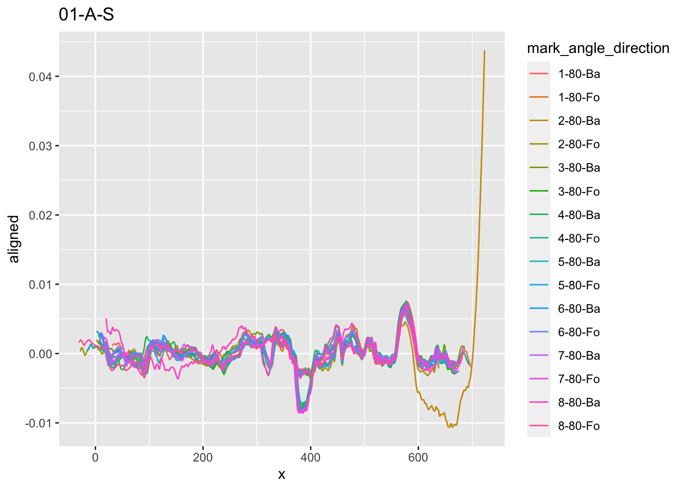
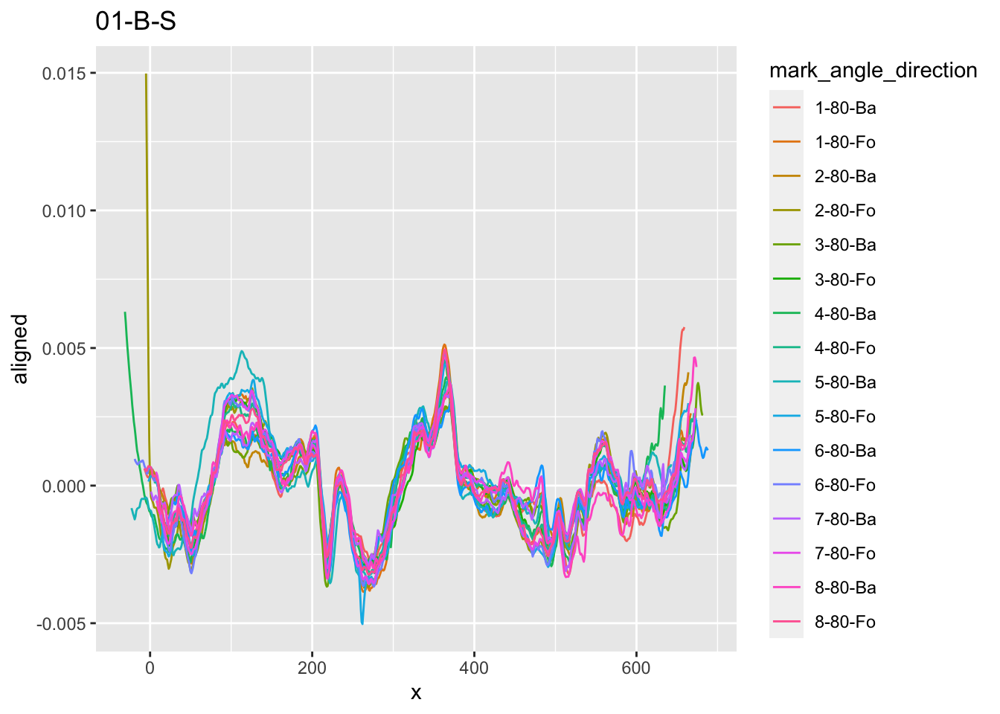

```{r setup, include = FALSE}
knitr::opts_chunk$set(
  collapse = TRUE,
  comment = "#>",
  echo = FALSE
)
library(tidyverse)
library(markers)
```

# Experimental Setup

Data is stored on private repo, extracted signatures are available in `toolmarks.Rdata` file.

```{r, echo = TRUE}
# loads object toolmarks
load(here::here("data/toolmarks.Rdata"))
```

Each signature is individualized by tool (1-20), size (S, M, L), mark (1-8), side (A,B), angle (60, 70, 80), direction (Fo/Ba)

```{r signatures}
signatures <- toolmarks %>% 
  group_by(tool, size, mark, side, angle, direction) %>%
  tidyr::nest()
```

Currently, there are `r nrow(signatures)` signatures collected. Figure @fig-overview contains an overview of the status quo.

```{r overview, out.width="\\textwidth", fig.cap="Overview of all collected signatures under each one of the experimental conditions. Each cell should be filled with a bar of height 8."}
signatures %>% 
  ggplot(aes(x = tool, fill = size)) + geom_bar() +
  facet_grid(side+ direction+angle~size, drop = TRUE, 
             scales = "free", space = "free") +
  scale_y_continuous(breaks=c(0,4,8))
```

All cells in this overview will, eventually, be filled in.

Align all signatures made by the same edge (side) of the same tool (tool & size), regardless of angle, direction, and repetition:

```{r echo=TRUE, eval=FALSE}
if (file.exists("aligned_signatures.rds")) {
  align_all <- readRDS("aligned_signatures.rds")
} else {
  align_all <- toolmarks %>%
    mutate(mark_angle_direction = sprintf("%s-%s-%s",mark,angle, direction)) %>%
    group_by(tool, size, side) %>% 
    tidyr::nest() %>%
    mutate(
      aligned = data %>% purrr::map(
        .f = function(d) {
          sig_align_set(d, value = signature,  group = mark_angle_direction)
        }
      )
    )
  saveRDS(align_all, "aligned_signatures.rds")
}
```

| Tool 1S - Edge A       | **Tool 1S - Edge B**   |
|------------------------|------------------------|
|  |  |

```{r, fig.cap="Sides A and B of tool 1S", fig.keep='all', out.width='0.5\textwidth', eval=FALSE}
align_all$aligned[[1]] %>% ggplot(aes(x =x, y = aligned)) + 
  geom_line(aes(colour = mark_angle_direction)) +
  ggtitle(paste(align_all[1,1:3], sep="-", collapse="-"))

align_all$aligned[[2]] %>% ggplot(aes(x =x, y = aligned)) + 
  geom_line(aes(colour = mark_angle_direction)) +
  ggtitle(paste(align_all[2,1:3], sep="-", collapse="-"))
```

## Quality control

For the marks of each tool edge, make sure that the alignment worked and we have good marks. The result is included in [aligned.pdf](aligned.pdf).

Generally: marks with signatures above a value of 0.01 seem to suffer from outliers along the boundaries of the profile. It would be helpful for the analysis to re-do  the signature extraction for these profiles (e.g. tool 1S, edge A, mark 2, backwards direction).

```{r eval=FALSE, echo=FALSE}
align_all <- align_all %>% 
  mutate(
    plot = aligned %>% purrr::map(
      .f = function(data) {
        data %>% ggplot(aes(x =x, y = aligned)) + 
  geom_line(aes(colour = mark_angle_direction)) +
          theme_bw() + 
          theme(legend.position="none")
      }
    )
  )

for (i in 1:nrow(align_all)) {
  align_all$plot[[i]] <- align_all$plot[[i]] + 
    ggtitle(paste(align_all[i,1:3], sep="-", collapse="-"))
}

library(gridExtra)

ml = do.call(marrangeGrob, list(align_all$plot, nrow=4, ncol=2))
ggsave(plot=ml, filename="aligned.pdf")       

aligned <- align_all %>% select(-data, -plot) %>% 
  unnest(col = aligned)
aligned <- aligned %>% select(-data)
saveRDS(aligned, file="toolmarks-aligned.rds")
```


For tool 1S above, we see that edge B is aligned well across all scans. Edge A seems also be aligned well, however, we see that there are two main patterns in the  extracted signatures. From the image below we see that these two main patterns can be explained by the directionality of making the mark:

```{r}
aligned <- readRDS("toolmarks-aligned.rds")
aligned <- aligned %>% separate(mark_angle_direction, into=c("mark", "angle", "direction"), remove=FALSE)
aligned %>% 
  filter(tool=="01", side=="A", size=="S") %>%
  ggplot(aes(x =x, y = aligned, colour = mark_angle_direction)) +
  geom_line() + facet_grid(.~direction) +
  theme_bw() +
  theme(legend.position = "none") +
  ggtitle("Tool 1S, Edge A") +
  ylim(c(-0.01, 0.01))
```

There seems to be generally a bit more variability on the left side of the mark when scraping the tool backwards across the surface.

Some of the alignments need to be re-done, e.g.:

### Tool 2L

```{r, fig.keep='all', out.width='.5\textwidth'}
aligned %>% 
  filter(tool == "02", size=="L", side=="A") %>%
  ggplot(aes(x = x, y = aligned)) +
  geom_line(aes(colour = mark_angle_direction)) +
  theme_bw() +
  ggtitle("Tool 2L-A") +
  theme(legend.position = "none")

aligned %>% 
  filter(tool == "02", size=="L", side=="B") %>%
  ggplot(aes(x = x, y = aligned)) +
  geom_line(aes(colour = mark_angle_direction)) +
  theme_bw() +
  ggtitle("Tool 2L-B") +
  theme(legend.position = "none")

```

```{r}
long <- 
  toolmarks %>%
  mutate(
    mark_angle_direction =
      sprintf("%s-%s-%s",mark,angle,direction)
  ) %>%
  filter(tool == "02", side=="A", size=="L") %>%
  group_by(angle) %>% tidyr::nest() %>%
  mutate(
    aligned = data %>% purrr::map(
      .f = function(d) {
        d %>%  sig_align_set(value = signature,  
                group = mark_angle_direction)
      }
    )    
  )
long$aligned[[1]] %>% 
  ggplot(aes(x = x, y = aligned)) +
  geom_line(aes(colour = mark_angle_direction))
long$aligned[[2]] %>% 
  ggplot(aes(x = x, y = aligned)) +
  geom_line(aes(colour = mark_angle_direction))
long$aligned[[3]] %>% 
  ggplot(aes(x = x, y = aligned)) +
  geom_line(aes(colour = mark_angle_direction))


```
